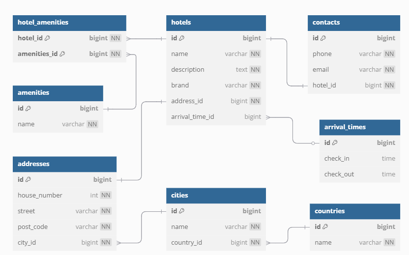

# Hotel Management API

## Описание проекта

Hotel Management API — это RESTful API-приложение для управления отелями. 

## Используемые технологии

- **Java 17+**
- **Spring Boot** 
- **Liquibase** 
- **H2 Database** 
- **Maven** 
- **Swagger** 
- **JUnit + Mockito** 

## Требования к окружению

- Java 17+
- Поддержка HTTP-клиента 

## Запуск приложения

### 1. Клонирование проекта

```
git clone https://github.com/your-repo/hotel-api.git
cd hotel-api
```

### 2. Сборка и запуск
```
mvn spring-boot:run
```
По умолчанию сервер стартует на http://localhost:8092/property-view.

### 3. Документация API (Swagger)

После запуска можно открыть Swagger UI:

Swagger UI: http://localhost:8092/property-view/swagger-ui.html

JSON-спецификация: http://localhost:8092/property-view/v3/api-docs


## База данных

### Схема



### Переключение

По умолчанию используется H2 (в памяти).

Чтобы использовать MySQL или PostgreSQL, измените настройки в application.properties и добавьте соответствующие зависимости `Maven`.

## Тестирование

__Запуск тестов:__
```
mvn test
```
